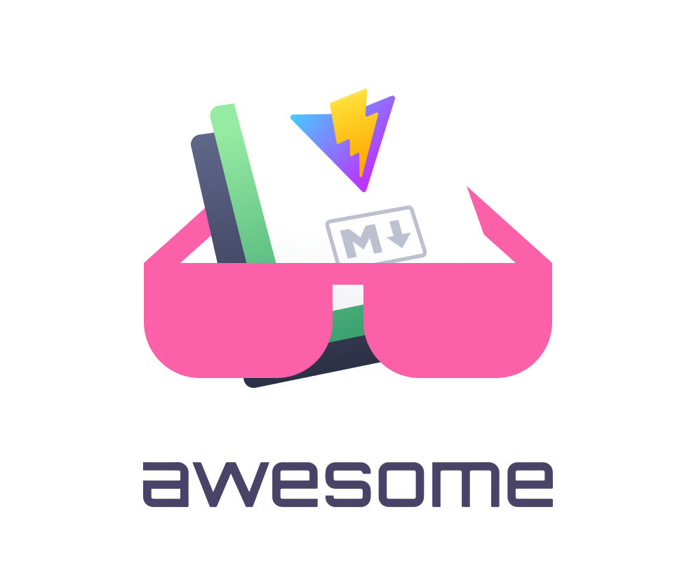

   
  
   

# Awesome VitePress v1 (Beta) 

> A curated list of awesome things related to VitePress

- [Resources](#books-resources)
  - [Official Resources](#official-resources)
  - [Tutorials](#tutorials)
    - [Articles](#articles)
    - [Videos](#videos)
  - [Related Awesome Lists](#related-awesome-lists)
- [Plugins](#electric_plug-plugins)
  - [Official Plugins](#official-plugins)
  - [Community Plugins](#community-plugins)
- [Themes](#art-themes)
  - [Official Themes](#official-themes)
  - [Community Themes](#community-themes)
- [Projects Using VitePress](#card_index_dividers-projects-using-vitepress)
- [VitePress Contributors](#heart-vitepress-contributors)
- [How to Contribute](#pray-how-to-contribute)
- [License](#white_check_mark-license)
- [Acknowledgement](#raise_hands-acknowledgement)

## :books: Resources

### Official Resources
- [VitePress Github Repository](https://github.com/vuejs/vitepress)
- Docs - [Getting Started](https://vitepress.dev/guide/getting-started), [Writing](https://vitepress.dev/guide/markdown), [Customization](https://vitepress.dev/guide/custom-theme), [Configuration](https://vitepress.dev/reference/site-config)

### Tutorials

> #### Articles
- [How to Build a Modern Documentation Site with VitePress](https://www.freecodecamp.org/news/how-to-build-a-modern-documentation-site-with-vitepress/)
- [Write Beautiful Documentation Quickly with VitePress](https://learnvue.co/articles/write-docs-with-vitepress)
- Create a Blog with Vitepress
  - [Part 1 - Create a Blog with Vitepress](https://medium.com/@jeremy3/create-a-blog-with-vitepress-c4b1c203d688)
  - [Part 2 - Create components in Vitepress using Tailwind](https://medium.com/@jeremy3/create-components-in-vitepress-using-tailwind-a4eee4b4ec41)
- [Build a blog with Vitepress and Vue.js](https://blog.logrocket.com/build-blog-vitepress-vue-js/)

> #### Videos
- [VitePress The New Vite Static Site Generator Tutorial by Erik](https://www.youtube.com/watch?v=y9jKmNPmfPE)
  1. [2:33](https://www.youtube.com/watch?v=y9jKmNPmfPE&t=153s) VitePress Introduction
  2. [4:33](https://www.youtube.com/watch?v=y9jKmNPmfPE&t=273s) Updating the Configuration
  3. [6:37](https://www.youtube.com/watch?v=y9jKmNPmfPE&t=397s) Updating Themes with Vue 3
- [Easy Documentation with VitePress by LearnVue](https://www.youtube.com/watch?v=jRBQpjmwH1c)
  1. [0:15](https://www.youtube.com/watch?v=jRBQpjmwH1c&t=15s) Advantages of VitePress
  2. [1:06](https://www.youtube.com/watch?v=jRBQpjmwH1c&t=66s) Getting Started
  3. [3:00](https://www.youtube.com/watch?v=jRBQpjmwH1c&t=180s) Routes & Links
  4. [6:05](https://www.youtube.com/watch?v=jRBQpjmwH1c&t=375s) Built-In Markdown
- [Deep dive into VitePress by Kia King Ishii](https://www.youtube.com/watch?v=GXr8FOssWqM)
  1. [1:40](https://www.youtube.com/watch?v=GXr8FOssWqM&t=100s) What is VitePress
  2. [4:10](https://www.youtube.com/watch?v=GXr8FOssWqM&t=250s) Basic Configuarion
  3. [7:15](https://www.youtube.com/watch?v=GXr8FOssWqM&t=435s) How VitePress works
  4. [9:25](https://www.youtube.com/watch?v=GXr8FOssWqM&t=565s) Core Components
  5. [14:50](https://www.youtube.com/watch?v=GXr8FOssWqM&t=890s) VitePress Plugin
  6. [23:25](https://www.youtube.com/watch?v=GXr8FOssWqM&t=1405s) VitePress Client Side

### Related Awesome List
- [Vue 3](https://github.com/vuesomedev/awesome-vue-3)
- [Vite](https://github.com/vitejs/awesome-vite)
- [VuePress 2](https://github.com/vuepress/awesome-vuepress/blob/main/v2.md)

## :electric_plug: Plugins

### Official Plugins
> Pending for official plugins

### Community Plugins
- [PWA](https://github.com/vite-pwa/vitepress) - Zero-config PWA Plugin for VitePress
- [Comment with Giscus](https://github.com/T-miracle/vitepress-plugin-comment-with-giscus) - vitepress comment plugin based on [Giscus](https://giscus.app/)
- [Google Analytics](https://github.com/ZhongxuYang/vitepress-plugin-google-analytics/) - Google Analytics Plugin for VitePress
- [Local Search with Flexsearch](https://github.com/emersonbottero/vitepress-plugin-search) - Local search to your documentation site using [Flexsearch](https://github.com/nextapps-de/flexsearch)
- [Diagramming and Charting with Mermaid](https://github.com/emersonbottero/vitepress-plugin-mermaid) - Diagramming and charting tool using [Mermaid](https://mermaid.js.org/)
- Sidebar
  - [vitepress-sidebar](https://github.com/jooy2/vitepress-sidebar) - Automatically configures and manages the sidebar of your page with simple settings
  - [vitepress-plugin-autobar](https://github.com/luciozhang/vitepress-plugin-autobar) - Generator sidebar based on file and directory structure
  - [vite-plugin-vitepress-auto-sidebar](https://github.com/QC2168/vite-plugin-vitepress-auto-sidebar) - Automatically generates sidebar data by scanning directories
  - [vitepress-sidebar-builder](https://github.com/stuyk/vitepress-sidebar-builder) - A recursive sidebar builder
  - [vitepress-plugin-auto-sidebar](https://github.com/JonathanSchndr/vitepress-plugin-auto-sidebar) - Generate the sidebar through the folder structure
- [Progress Bar with NProgress](https://github.com/ZhongxuYang/vitepress-plugin-nprogress/) - Display slim progress bar like on YouTube, Medium, etc with [NProgress](https://github.com/rstacruz/nprogress)
- [Static Code Samples with Twoslash](https://github.com/wagmi-dev/vitepress-plugin-shiki-twoslash) - Display code samples on markdown using [Shiki Twoslash](https://github.com/shikijs/twoslash)
- [Timeline for Markdown](https://github.com/HanochMa/vitepress-markdown-timeline) - Display vertical timeline in Markdown
- [Live Coding on Browser](https://github.com/jerrywu001/vitepress-plugin-sandpack) - Live coding using [Sandpack](https://github.com/jerrywu001/sandpack-vue3)
- [Collapsable Code Blocks](https://github.com/T-miracle/vitepress-plugin-codeblocks-fold) - Collapse long code blocks in Markdown
- [View Image](https://github.com/T-miracle/vitepress-plugin-image-viewer) - Image viewer base on [Viewer.js](https://github.com/fengyuanchen/viewerjs)
- [Zip Build Folder](https://github.com/manchan4869/vitepress-plugin-compression) - Automatically package the build output folder using 7za.exe
- [Export to PDF](https://github.com/condorheroblog/vitepress-export-pdf) - Allows you to export your sites to a PDF file
- [Preview Demo](https://github.com/flingyp/vitepress-demo-preview) - Preview demo and show source codes
- [Override Default Theme](https://github.com/Dschungelabenteuer/vitepress-plugin-theme-override) - Override parts of Vitepress' default theme without the need to import it all
- [lite-tree](https://github.com/zhangfisher/lite-tree) -  Easy to render tree on vitepress
- [vitepress-i18n](https://github.com/jooy2/vitepress-i18n) - VitePress i18n is a plugin for VitePress that makes it easy to translate text in the default theme and search tool
  
## :art: Themes

### Official Themes
- [Default Theme](https://vitepress.dev/reference/default-theme-config)
- [Vue Theme](https://github.com/vuejs/theme) - Dedicated for `vuejs.org` and may defer from the default theme

### Community Themes
- [vitepress-theme-demoblock](https://github.com/xinlei3166/vitepress-theme-demoblock) - Based on the original Vitepress theme
- Blog Style
  - [sugar-blog](https://github.com/ATQQ/sugar-blog) - A Minimalist, blog style theme
  - [vitepress-blog-pure](https://github.com/airene/vitepress-blog-pure) - Minimal vitepress theme for blog
  - [vitepress-blog-zaun](https://github.com/clark-cui/vitepress-blog-zaun) - Journal style theme
  - [vitepress-theme-sakura](https://github.com/flaribbit/vitepress-theme-sakura) - A cute and animated blog theme for vitepress
- [hexo-theme-linear](https://github.com/yysuen/hexo-theme-linear) - Theme with clean look, blog style
- [vitepress-theme-vuetom](https://github.com/lauset/vitepress-theme-vuetom) - A flat vitepress theme
- [shopware-developer-documentation-vitepress](https://github.com/shopware/developer-documentation-vitepress)
- [hexo-theme-yun](https://github.com/YunYouJun/hexo-theme-yun) - A blog style theme for vitepress
- [vitepress-theme-api](https://github.com/logicspark/vitepress-theme-api) - An API document theme for Vitepress
- [vitepress-theme-carbon](https://github.com/brenoepics/vitepress-carbon) - A GitHub-like theme for Vitepress

## :card_index_dividers: Projects Using VitePress

### Official Projects
- [Vue.js Website](https://vuejs.org) - Official Vue documentation at `vuejs.org`

### Projects
- [Vite Ruby](https://github.com/ElMassimo/vitepress-theme) - Vite Ruby docs based on the official Vue doc theme
- [StackBlitz Docs](https://github.com/stackblitz/docs) - Documentation for [StackBlitz](https://stackblitz.com/), an online development 
- [Genshin Interactive Map](https://github.com/kongying-tavern/docs) - Kongying Tavern Genshin Interactive Map Documentation
environment.
- [ruabick](https://github.com/dewfall123/ruabick) - Dumi like tool
- [Slidev](https://github.com/slidevjs/docs) - Documentation for [Slidev](https://sli.dev/), Presentation Slides for Developers
- [MODX Revolution](https://github.com/modx-pro/Docs) - Open Source documentation for [MODX Revolution](https://modx.pro/)
- [Rollup.js](https://github.com/rollup/rollup-docs-cn) - Documentation for [Rollup](https://rollupjs.org/), The JavaScript module bundler
- [MTGJSON](https://github.com/mtgjson/mtgjson-website) - MTGJSON Documentation
- [Windi CSS](https://github.com/windicss/docs) - Documentation for Windi CSS
- [Omnivore](https://github.com/omnivore-app/docs.omnivore) - Documentation for the [Omnivore](https://omnivore.app/), an open source read-it-later solution
- [Iconify](https://github.com/iconify/website) - Documentation for [Iconify](https://iconify.design/), over 150,000 open source vector icons in one framework
- [Fusion UI](https://github.com/tsinghua-lau/fusion-ui) Documentation for [Fusion UI](https://tsinghua-lau.github.io/fusion-ui/), a Vue 3 component library
- [upscale](https://github.com/Phhofm/upscale) - Website to visually compare the output created with over 600 different AI upscaling models.
- [asdf](https://asdf-vm.com) - Manage multiple runtime versions with a single CLI tool, extendable via plugins.
- [Chromatone.center](https://chromatone.center) - Visual Music Language web-site. Learn music theory with colors and improve your music practice with interactive web-apps.
- [Graffle](https://graffle.js.org) - Simple GraphQL Client for JavaScript. Minimal. Extensible. Type Safe. Runs everywhere.

### Blogging Websites
- [harlanzw.com-vitepress](https://github.com/harlan-zw/harlanzw.com-vitepress) - Personal [blog](https://harlanzw.com/) built using VitePress and TailwindCSS
- [Charles's personal blog](https://github.com/Charles7c/charles7c.github.io) - Personal technology [blog](https://blog.charles7c.top/)
- [Code More Create](https://blog.merlin218.top/)

## :heart: VitePress Top Contributors

## :pray: How to Contribute
Thank you for your interests in Awesome VItepress. All kinds of contributions are valuable to making Vitepress more popular!

We ask that you kindly follow this simple guideline
1. Make sure to add items in the right section or subsection!
2. To be fair to people before you, please add your items at the end.
3. Feel free to reorganize sections or subsection as appropriate, including adding new ones or editing current ones.
4. If you could, please provide details or documentation links to each item. Please do not add items that are invalid, public archive or not functioning.

Remark: We may revise content or remove unrelated, outdated or no longer supported items.

## :white_check_mark: License
Distributed under the MIT License. See [`LICENSE`](https://github.com/logicspark/awesome-vitepress-v1/edit/main/LICENSE) for more information.

## :raised_hands: Acknowledgement
- [Awesome](https://github.com/sindresorhus/awesome)
- [VitePress](https://github.com/vuejs/vitepress)
- [Vite](https://github.com/vitejs/vite)
- [Awesome-VuePress](https://github.com/vuepress/awesome-vuepress/tree/main)
